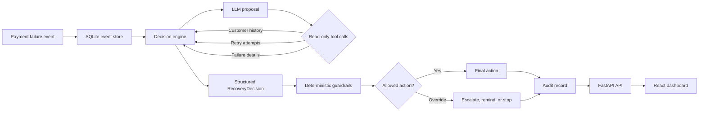

# Recover — AI-Powered Revenue Recovery Agent

Recover is a bounded, explainable decision engine for failed-payment recovery. It combines an LLM's contextual judgment with deterministic business guardrails, then records every proposal, tool call, override, and final action for review.

## 1. Problem

Payment failures create recoverable revenue loss, but not every failed payment should be retried or reminded. The right response depends on retry history, failure reason, customer history, and payment amount, so a single hardcoded rule is too rigid. Recover uses the LLM for context-sensitive judgment while keeping money-related authority in a deterministic rules layer.

## 2. What This Does

Recover reads a failed-payment event, asks an LLM to propose one of four recovery actions, gives the model read-only context through local tools, and applies hard business limits before recording the result. A FastAPI backend exposes the audit trail and metrics, while the React dashboard makes decisions, overrides, reasoning, and evaluation results easy to inspect.

**TL;DR:** The LLM recommends; deterministic guardrails decide what is allowed; every result is auditable.

## 3. Architecture



The runtime is a bounded routing and evaluation agent, not a fully autonomous payment operator. The LLM can gather context and propose an action, but it cannot directly execute a payment, change database state through tools, or bypass policy. The system creates a clear boundary between probabilistic reasoning, deterministic safety checks, and the audit trail. In the current prototype, the final action is selected and logged; integration with a payment provider would be the next execution boundary.

## 4. The Bounded/Gated Design

The current guardrails are:

- **Maximum retry limit:** If `retry_count >= max_retries`, an LLM retry proposal is overridden and escalated to a human.
- **High-value protection:** If the amount is greater than `1,000`, automatic retry or reminder proposals are overridden and escalated to a human.
- **Insufficient-history protection:** If the customer has no prior history, an automatic retry proposal is changed to `send_reminder`.
- **Strict action vocabulary:** Only `retry`, `send_reminder`, `escalate_to_human`, and `stop_pursuing` are valid actions.
- **Structured output validation:** The model must return `action`, `reasoning`, and `confidence`; malformed output receives one corrective prompt and is then rejected.
- **Read-only tools:** The model can inspect customer history, retry attempts, and payment failure details, but tools do not perform money movement.
- **Auditability:** The proposal, tool calls, rule override, final action, confidence, and human-review flag are persisted.

**The LLM never has final authority over a money action — the rules layer does.**

## 5. Results

Latest local evaluation snapshot:

| Measure | Result |
|---|---:|
| Total synthetic events | 200 |
| Audited events | 130 |
| True positives | 85 |
| True negatives | 24 |
| False positives | 1 |
| False negatives | 20 |
| Precision | 98.84% |
| Recall | 80.95% |
| F1 score | 89.01% |
| False-positive rate | 4.00% |
| Rule overrides | 25 |
| Modeled recovery opportunity | ₹42,274.78 |

The recovery opportunity is the sum of event amounts whose final action is `retry` or `send_reminder`. It is **not confirmed recovered revenue**, because the current system does not receive payment-provider success webhooks or settlement outcomes. False positives represent pursuing a payment that the ground truth classifies as non-recoverable; false-negative cost represents the amount associated with missed recoverable opportunities.

Dashboard links:

- [Live dashboard](https://revenue-recovery-jet.vercel.app)
- [Live FastAPI docs](https://revenue-recovery-yfyk.onrender.com/docs)
- [Evaluation report](docs/evaluation_results.md)
- [GitHub repository](.)

## 6. The Failure Case

**Failure:** The LLM can return malformed JSON, free-form prose, an unsupported action, or fail while gathering context.

**What Recover does:** The decision engine validates the response against the `RecoveryDecision` schema. It issues one corrective prompt for malformed output; if the next response is still invalid, the event is rejected. During batch processing, the runner catches the failure, leaves the event without an unvalidated audit row, and continues with the remaining events. The dashboard also exposes a human-readable failure-case explanation.

**Why this is correct:** A money-handling system should skip an ambiguous decision rather than silently invent an action or execute an unvalidated one. The event remains available for reprocessing or human review, and no unsafe decision reaches the audit trail as if it were valid.

## 7. Tech Stack

- Python 3.13+
- FastAPI and Uvicorn
- Pydantic
- OpenRouter through the OpenAI-compatible Python SDK
- SQLite
- React and Vite
- Tailwind CSS with the Vite plugin
- Framer Motion
- Pytest

## 8. What I'd Do With More Time

- Add payment-provider webhooks and a `payment_outcome` field so the dashboard can report confirmed recovered revenue instead of modeled opportunity value.
- Evaluate on a larger held-out dataset with multiple event types, including subscription renewals and checkout abandonment.
- Add a human-in-the-loop queue for escalated cases, including reviewer decisions and feedback that can improve future evaluation.

## 9. How to Run It

### Prerequisites

- Python 3.13 or compatible Python version
- Node.js and npm
- An OpenRouter API key

### Backend setup

From the repository root:

```bash
python3 -m venv .venv
source .venv/bin/activate
pip install -r requirements.txt
cp .env.example .env
```

Set the API credentials in `.env`:

```env
OPENROUTER_API_KEY=your_openrouter_key
OPENROUTER_MODEL=openrouter/free
OPENROUTER_BASE_URL=https://openrouter.ai/api/v1
DATABASE_URL=sqlite:///./data/synthetic_events.db
API_HOST=127.0.0.1
API_PORT=8000
FRONTEND_URL=http://127.0.0.1:5173
```

The repository database contains the current evaluated data. For a fresh synthetic dataset only, run:

```bash
PYTHONPATH=. python3 backend/scripts/generate_synthetic_data.py
```

Start the API:

```bash
PYTHONPATH=. uvicorn backend.app.main:app --reload
```

Useful API routes:

```text
GET  /api/metrics/summary
GET  /api/audit-log
GET  /api/events
POST /api/single-event/{event_id}
GET  /docs
```

### Run evaluation

Run a batch over the configured events:

```bash
PYTHONPATH=. python3 backend/app/services/batch_runner.py
PYTHONPATH=. python3 backend/app/services/compute_metrics.py
```

The single-event evaluator is available from the dashboard's **Evaluate Event** tab.

### Dashboard setup

In a second terminal:

```bash
cd dashboard
npm install
```

For local development, the Vite proxy forwards `/api` to `http://localhost:8000`. To call a deployed backend directly, set:

```env
VITE_API_BASE_URL=https://revenue-recovery-yfyk.onrender.com
```

Start the dashboard:

```bash
npm run dev
```

Open the URL printed by Vite, usually `http://localhost:5173`.

## 10. Links

- **Live dashboard:** https://revenue-recovery-jet.vercel.app
- **Live backend and API docs:** https://revenue-recovery-yfyk.onrender.com/docs
- **Source repository:** [this repository](.)
- **Evaluation report:** [docs/evaluation_results.md](docs/evaluation_results.md)

No video walkthrough is included yet.